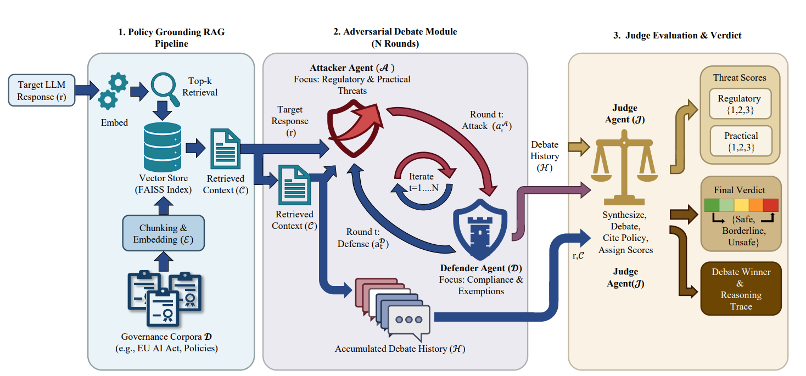
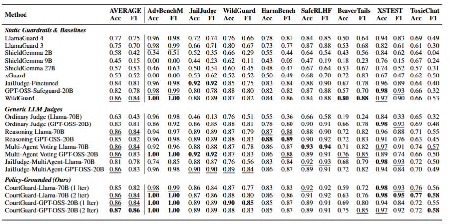
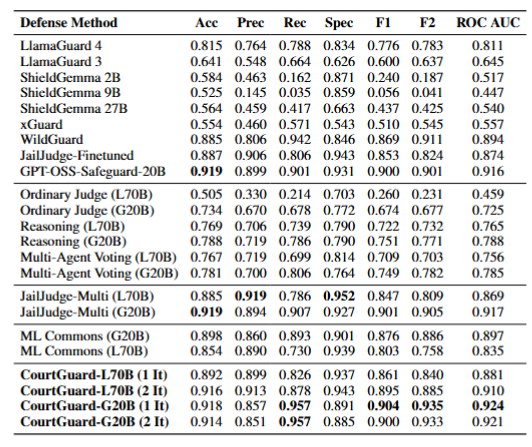

# CourtGuard: A Model-Agnostic Framework for Zero-Shot Policy Adaptation in LLM Safety

<p align="center">
  
</p>

<p align="center">
  <a href="https://court-guard.github.io"><strong>🌐 Project Page</strong></a> 
  <a href="https://anonymous.4open.science/r/CourtGuard_ICML/README.md"><strong>💻 Code & Datasets</strong></a> 
</p>

---

## Overview

**CourtGuard** is a retrieval-augmented multi-agent framework that reimagines LLM safety evaluation as **Evidentiary Debate**. Instead of relying on static, fine-tuned classifiers, CourtGuard grounds every safety decision in external policy documents retrieved at inference time — enabling zero-shot adaptation to new governance rules without any retraining.

> **Under review at ICML.**

### Key Numbers

| Metric | Value |
|--------|-------|
| Safety benchmarks evaluated | 8 |
| Average Accuracy (CourtGuard-GPT-OSS-20B, 2 Iter) | **0.87** |
| Zero-shot Wikipedia Vandalism accuracy | **90%** |
| Expert-AI Alignment (Legal / GDPR domain) | **93.9%** |

---

## The Problem: Adaptation Rigidity

Current LLM safety defenses fall into three rigid paradigms:

- **Static Guardrails** (e.g., LlamaGuard, WildGuard, ShieldGemma) — bake safety rules into model weights; require costly retraining whenever policies change ("alignment lag").
- **Agentic Adjudication** (e.g., JailJudge) — rely on parametric intuition, leading to hallucination and drift toward generic base-model morality rather than domain-specific rules.
- **Policy-Following Frameworks** (e.g., GPT-OSS-Safeguard) — allow inference-time policy input but suffer from architectural coupling (vendor lock-in) and single-pass reasoning.

**CourtGuard unifies all three paradigms** while solving each limitation through policy-grounded adversarial debate.

---

## Framework Architecture

CourtGuard operates as a three-stage pipeline:

### 1. Policy Grounding RAG Pipeline
Governance documents (e.g., MLCommons AILuminate v1.1, OpenAI Usage Policies, GDPR, Wikipedia WP:VANDAL) are chunked, embedded with `sentence-transformers/all-mpnet-base-v2`, and indexed in a FAISS vector store. At inference time, the top-k most semantically relevant clauses are retrieved to ground all downstream debate.

### 2. Adversarial Debate Module (N rounds, default N=2)
- **Attacker Agent** — Identifies regulatory violations (citing retrieved policy clauses) and practical harm pathways (quantifying effort reduction, skill threshold lowering, time-to-harm).
- **Defender Agent** — Counters with evidence of compliance, applicable exemptions (research, education, journalism), and implementation barriers.

Agent states evolve across rounds; each agent has access to the full debate history and retrieved context.

### 3. Judge Evaluation & Verdict
The Judge synthesizes the debate and assigns:
- **Regulatory Threat Score** ∈ {1, 2, 3}
- **Practical Threat Score** ∈ {1, 2, 3}
- **Total Rating** = sum of both scores ∈ [2, 6]
- **Verdict**: `SAFE` (≤3) · `BORDERLINE` (=4) · `UNSAFE` (≥5)

A debate winner is declared based on argument strength and policy alignment, producing a fully traceable reasoning trace.

---

## Main Results

CourtGuard-GPT-OSS-20B (2 Iter) achieves the **highest macro-average accuracy (0.87) and F1 (0.86)** across 8 benchmarks, outperforming dedicated fine-tuned guardrails without any fine-tuning.

<p align="center">
  
</p>

### Benchmarks Evaluated

| Dataset | N | Focus |
|---------|---|-------|
| WildGuard | 450 | 15 harm categories including benign queries |
| HarmBench | 210 | 10 automated attack methods (GCG, AutoDAN, PAIR, TAP, etc.) |
| JailJudge | 300 | 14 hazard codes, 5 complexity levels |
| PKU-SafeRLHF | 180 | Fine-grained severity annotations (Levels 1–3) |
| ToxicChat | 270 | Real-world user-AI interactions |
| BeaverTails | 180 | Human-preference safety dataset |
| XSTest | 180 | Over-refusal evaluation (contrastive safe/unsafe prompts) |
| AdvBenchM | 50 | Custom adaptive attack set (100% ASR, human-verified) |

### Human-Verified Attack Suite

Evaluated against 9 adversarial attack styles (DrAttack, Puzzler, AutoDAN, DAN, GCG, PAIR, TAP, Adaptive Attack, Alpaca) annotated by 3 human raters (Fleiss' κ = 0.786).

<p align="center">
  
</p>

**CourtGuard-GPT-OSS-20B (1 Iter)** achieves the highest Recall (0.957), F2 (0.935), and ROC AUC (0.924) on this suite.

---

## Zero-Shot Policy Adaptation

A core contribution is demonstrating that CourtGuard generalizes to **completely out-of-domain tasks** by simply swapping the reference policy — no fine-tuning required.

### Wikipedia Vandalism Detection

By replacing the MLCommons Safety Policy with Wikipedia's WP:VANDAL policy, CourtGuard achieved **90% accuracy** on the PAN-WVC-10 corpus — matching the dedicated `gpt-oss-safeguard-20b` baseline and outperforming the base `gpt-oss-20b` model (86%).

| Model | Accuracy |
|-------|----------|
| gpt-oss-20b (Base Judge) | 86% |
| gpt-oss-safeguard-20b (Policy-Following) | 90% |
| **CourtGuard (Ours)** | **90%** |

### Legal & Privacy Compliance (GDPR / InfoSoc Directive)

Grounded in GDPR Articles 5 & 6 and the InfoSoc Directive Articles 2 & 3, CourtGuard achieved a **93.9% Expert-AI Alignment** rate across 33 complex privacy and intellectual property cases reviewed by a qualified legal expert.

---

## Automated Data Curation & Auditing

CourtGuard functions as a **high-fidelity policy auditor**, identifying label noise in existing benchmarks. Labels were only flipped when three human auditors unanimously agreed with CourtGuard's reasoning.

| Dataset | Flip Rate |
|---------|-----------|
| BeaverTails | 14.67% |
| ToxicChat | 14.44% |
| XSTest | Low (by design) |

After auditing, CourtGuard-GPT-OSS-20B (2 Iter) achieves **0.92 accuracy / 0.90 F1** on the corrected labels.

---

## Architectural Agnosticism

CourtGuard is backbone-agnostic and has been validated on:

- `Llama-3-70B-Instruct`
- `GPT-OSS-20B`

This enables:
- **Heterogeneous composition** — lightweight models for Defender, larger reasoning models for Judge.
- **No vendor lock-in** — safety logic lives in the RAG pipeline, not the model weights.
- **Future-proof upgradability** — plug in newer models as they emerge without retraining.

---

## Ablation: Policy Breadth vs. Debate Architecture

| Configuration | JailJudge Acc | WildGuard Acc | HarmBench Acc |
|---------------|--------------|--------------|--------------|
| Static (No RAG) | 0.817 | 0.863 | 0.781 |
| CourtGuard-MLC only (2 Iter) | 0.840 | 0.867 | 0.800 |
| CourtGuard-Full (1 Iter) | **0.893** | **0.897** | **0.852** |
| CourtGuard-Full (2 Iter) | 0.887 | 0.876 | 0.852 |

Both the RAG grounding and the adversarial debate structure contribute independently to performance gains.

---

## Limitations

1. **Inference Latency** — The multi-turn debate and retrieval pipeline introduces higher latency compared to single-pass classifiers.
2. **Instruction Adherence** — Smaller or less capable backbone models may fail to generate correctly structured outputs, causing parsing errors.

---

## Authors

**Umid Suleymanov\*, Rufiz Bayramov\*, Suad Gafarli\*, Seljan Musayeva, Taghi Mammadov, Aynur Akhundlu, Murat Kantarcioglu**

Virginia Tech · ADA University

(\* Equal contribution)

---

## Citation

If you find CourtGuard useful for your research, please cite:
```bibtex
@inproceedings{courtguard2025,
  title     = {CourtGuard: A Model-Agnostic Framework for Zero-Shot Policy Adaptation in LLM Safety},
  author    = {Suleymanov, Umid and Bayramov, Rufiz and Gafarli, Suad and Musayeva, Seljan and Mammadov, Taghi and Akhundlu, Aynur and Kantarcioglu, Murat},
  booktitle = {International Conference on Machine Learning (ICML)},
  year      = {2025},
  note      = {Under review}
}
```

---

## License

This repository and associated artifacts are released for **academic and research purposes** only. See the [open science repository](https://anonymous.4open.science/r/CourtGuard_ICML/README.md) for full code and datasets.
